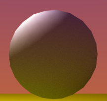
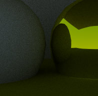
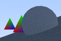
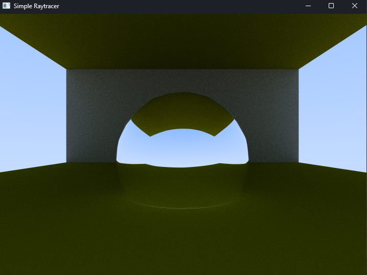
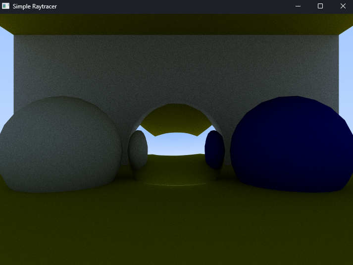
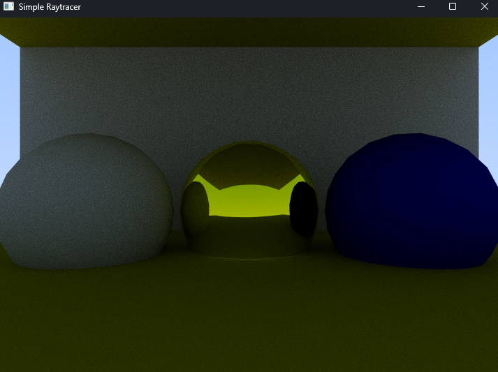
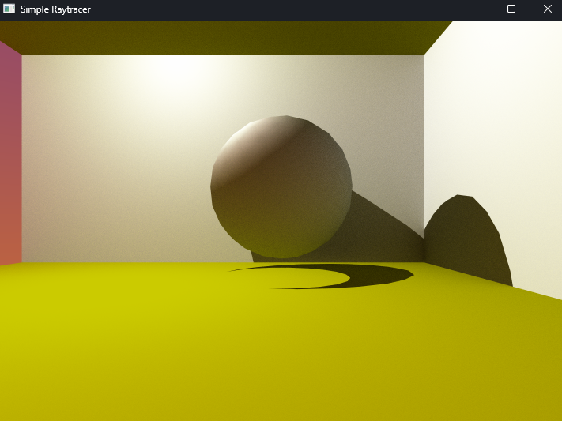
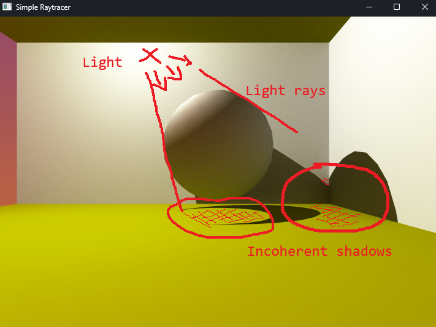
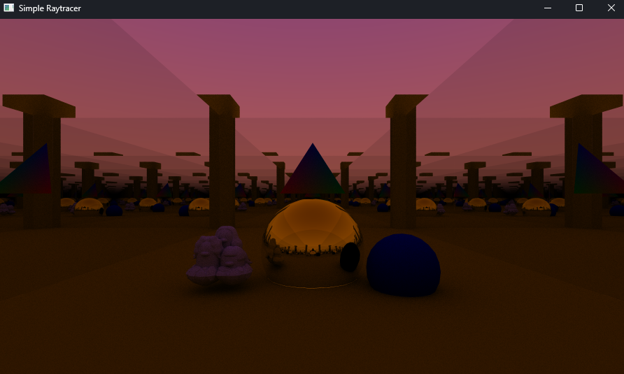

# Simple Raytracer - Diego FRAUEL CASTRO

  
   
  

## Overview

Personal project with the goal of making a raytracing renderer.
The first approach will be CPU based, and future expansions could lead to adapting it to be used in rendering APIs such as OpenGL or Vulkan, and seek optimizations.
This project will help me learn more about graphics programming and about rendering methods other than rasterization, by going more in-depth than I did with my previous experiences in Vulkan and OpenGL.

This is a work is still a work in progress, although not a priority.
\
\
Started on the 3rd of December 2025.

## Summary

- [Features](#features)
- [How to Run the Project](#how-to-run-the-project)
- [Screenshots](#screenshots)
- [Notes](#notes)
- [Credits](#-credits)

## Features

### Ray tracing rendering

- **Forward ray tracing :** Rays start from the eye (camera) and get launched into the scene.

- **Current lighting :**
    - Indirect lighting (global illumination) support.
    - Direct lighting (sampling scene lights directly), is not yet fully implemented (see [Screenshots](#screenshots) & [Notes](#notes) sections).

- **Recursive ray launching :** After a ray **hits** a surface, **depending on the material** of the hit Vertex, a **new ray will be launched recursively** until either maximum recursion has been reached, or no other object has been hit. **Ray bouncing direction is calculated** using the **Monte-Carlo inegration method**. This behavior helps **simulate real-life light behavior**.

- **Multisampling per pixel :** Multiple jittered rays launched for the **same pixel** to have a **nice smoother and more accurate color**, therefore **reducing noise** in the image, but also ***drastically* increasing rendering time**.

- **Multithreaded rendering :** As each pixel of the screen is independent, the image is separated into square chunks and each chunk is computed in a different thread, thus greatly speeding up the process of rendering. 

- **Ray to 3D models optimized collisions :** 
    - All maths are done in **object's local space** (**only the ray needs to be transformed** to local space, and **eventually the hit point to world space, if it exists**). The mesh/entity's vertices stay in their original object space values.
    - **Minimum** and **maximum** hit distance provided.
    - **Quick discard** of useless meshes by **detecting collision** between **ray** and closest hit point inside **bounding box**. **If no hit, then no further complex detection** with given mesh.
    - ***Möller-Trumbore intersection algorithm*** between **ray** and **triangle**.

- **Customizable parameters :**
    - Recursion maximum depth.
    - Samples per pixel.
    - Image size (in pixels).
    - Camera's vertical field of view angle (degrees).
    - Toggle multithreaded rendering.
    - If multithreaded rendering is enabled : tile size in pixels (square chunk rendered in a separate thread).

- **Only one frame rendered :** Despite the optimizations, a single frame can take a lot of time depending on the number of triangles on screen, and the parameters used.

### Scene graph, transforms and component system

- **An `Entity` contains a transform** (position, rotation, scale), and **can also contain components**. Each `Entity` in the `Scene` **tree hierarchy** can contain **at most only one** component of each type for simplicity purposes.

- **Component system :** each component inherits from the `IComponent` interface class and features lifetime methods such as `Start()`, `Update()`, `LateUpdate()`, `OnDestroy()`, ...

- **Current components available as of now :** 
    - **Mesh Renderer :** Contains a **mesh** and a **material** (to determine light bouncing behavior).
    - **(TBF) Light :** Contains info for a **light source** bound to the entity that owns this component. Light can have a **color** and an **intensity**.

- **Materials :**
    - **DIFFUSE :** Plastic-matte material.
    - **METALLIC :** Metallic reflecting material.
    - **(TBF) DIELECTRIC :** Transparent/glass-like material. 

- **Home-made math library :** Row-major matrices (2x2, 3x3, 4x4), Vectors (2D, 3D, 4D). 

## How to Run the Project

Build the project and run `simple_raytracer.exe` inside `build/$(Platform)/$(Configuration)/` folder. Make sure to also have the `Assets/` folder in the same directory as the executable, or else the resources won't load properly.

## Screenshots

### Diffuse and metallic materials

\
\

\
\

### Failed first attempt at direct lighting (point light)

\
\

### Showcase scene

- **FEATURES :**
    - Global Illumination coming from the sky (indirect light).
    - Colored diffuse materials.
    - Colored metallic materials.
    - Complex 3D model with a relatively high triangle count, and a stable result.
    - Visible vertex interpolation (classic tri-color triangle).
    - Visible ray recursivity (mirrors).
- **PARAMETERS :**
    - **Image extent :** 900x512 pixels.
    - **Samples per pixel :** 200 rays per pixel.
    - **Maximum recursivity depth :** 100 recursive rays per sample.
    - **Multithreading enabled**.
    - **Tile size :** 1 tile = 32 pixels per thread at once.
    - **Scene complete triangle count :**
        - **Walls(4) + Ground(1) + Pillars(4) :** 108 triangles (12 each).
        - **Icospheres(2) :** 640 (320 each).
        - **1 single tri-color triangle**.
        - **Complex mesh used in the image :** 5998 triangles.
        - ***Total :* 6747 triangles**.

- **RESULTS *(mesured with a hand chronometer, the old-school way...)* :**
    - **With the complex mesh (6747 triangles):** Approximately 1 min 54s.
    - **Without the complex mesh (749 triangles):** Approximately 25s
\
\

## Notes

- Most of the stuff seen here is the accumulation of a ton of programming knowledge acquired during my first 2 years of game programming : rendering pipeline, code architecture and conventions, scene graph, interfaces and polymorphism, 3D mathematics (transforms) and physics (lighting and 3D collisions), libraries, shading, multithreading.

- Some stuff is unfinished for this version (direct lighting and dielectric materials). This will be solved in a future version.

- The scene is created manually in one file for simplicity purposes, as there is no UI to customize.

- The poject uses SDL3 for windowing and drawing on screen.

- Meshes can only be loaded if they are in wavefront (.obj) format, and are already triangulated.

- Make sure to have a C++20 compatible compiler or higher.

- Note that this project is subject to change as it is far from being finished. This is the first version that I consider as minimalistically functional.

- **Non-exhaustive TO DO list of what could be coming next :**
    - Fix direct lighting for point lights.
    - Finish direct lighting behavior for spotlights and directional lights.
    - Finish dielectric material.
    - Add an emissive material (?).
    - Make materials more complete (add unique settings).
    - Make camera an entity component, and take account of its transform before rendering image.
    - BVH Optimization.
    - Textures/Images support on meshes/materials (stb_image.h).
    - Normal mapping.
    - More 3D mesh formats loading (.fbx, ...).
    - Render more than 1 frame. Possibly render a fixed-framerate video (?).
    - Eventually move the rendering process from CPU to GPU (Prefer Vulkan ?)

---

## Credits and sources

**Author**
- Diego FRAUEL CASTRO

**Research and sources**
- [Ray tracing (graphics) - Wikipedia](https://en.wikipedia.org/wiki/Ray_tracing_(graphics)#Recursive_ray_tracing_algorithm)
- [Ray Tracing in One Weekend - Guide](https://raytracing.github.io/books/RayTracingInOneWeekend.html)
- [Scratchapixel's Ray Tracing Overview - Guide](https://www.scratchapixel.com/lessons/3d-basic-rendering/ray-tracing-overview/light-transport-ray-tracing-whitted.html)
- [Sebastian Lague's Ray Tracing - Video overview](https://www.youtube.com/watch?v=Qz0KTGYJtUk)
- [About Monte-Carlo integration - Reddit post 1](https://www.reddit.com/r/GraphicsProgramming/comments/1dzu4vm/monte_carlo_in_the_context_of_path_tracing/)
- [About Monte-Carlo integration - Reddit post 2](https://www.reddit.com/r/raytracing/comments/q6o4zc/need_help_understanding_brdfmonte_carlo/)
- [TutorialsPoint about Ray Tracing - Guide](https://www.tutorialspoint.com/computer_graphics/transparency_and_refraction_in_ray_tracing.htm)
\
\
\
***Last Updated 26/02/2026***